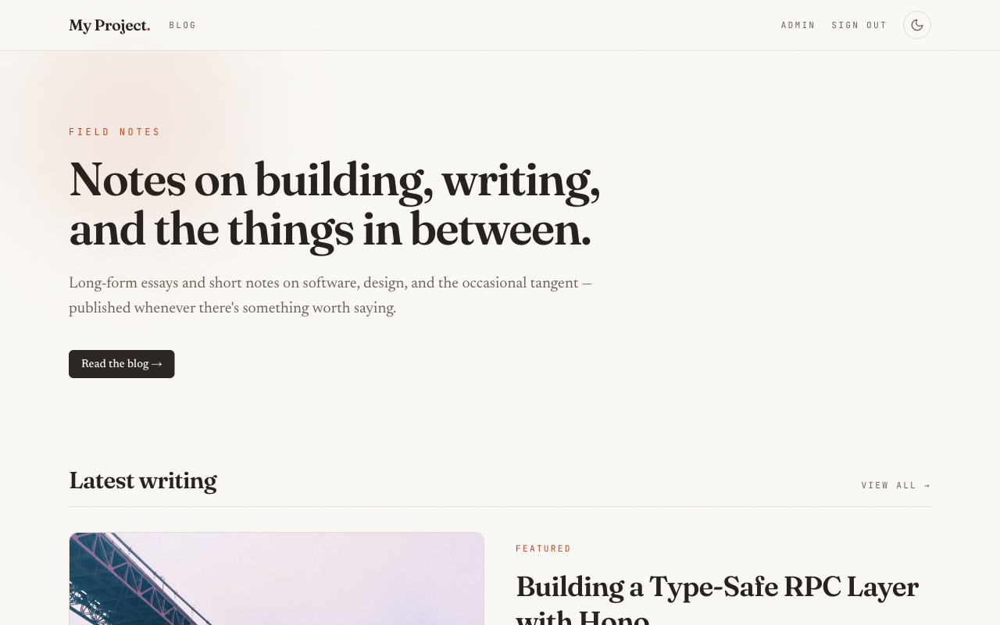
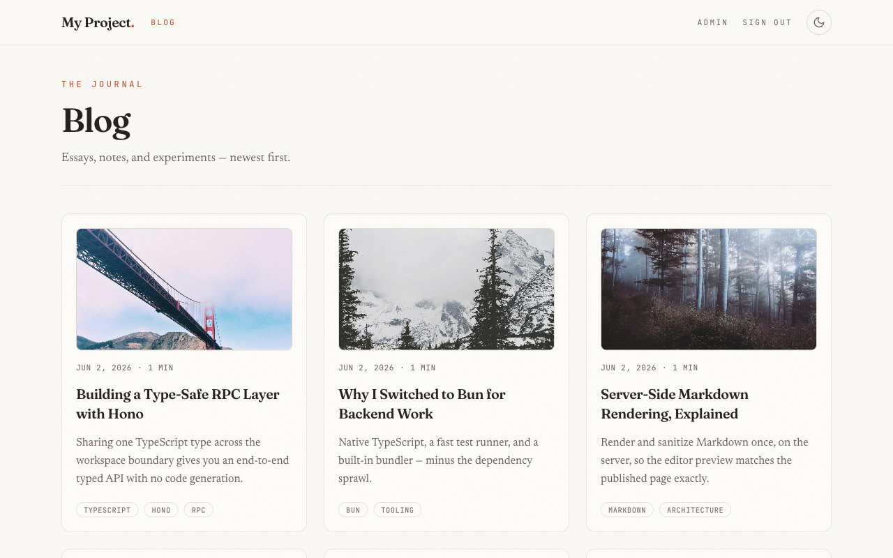
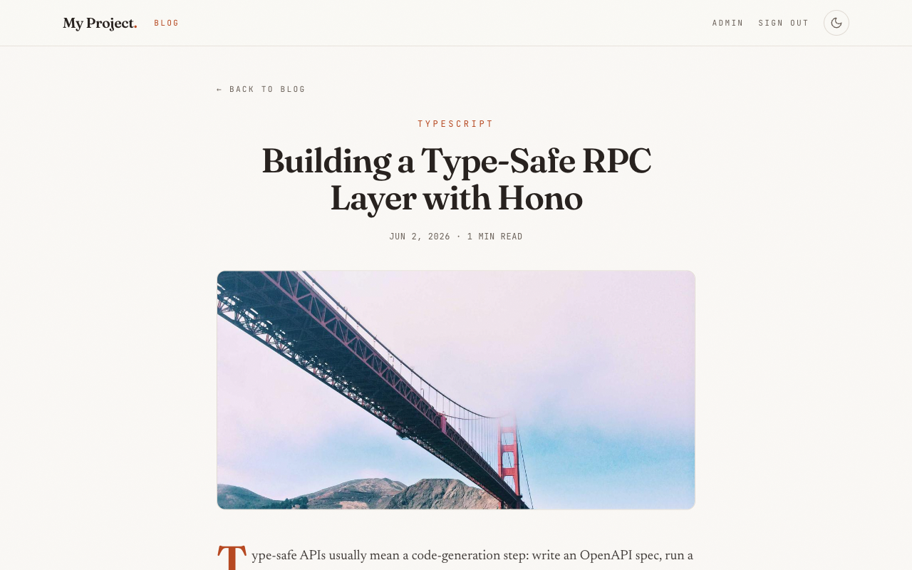
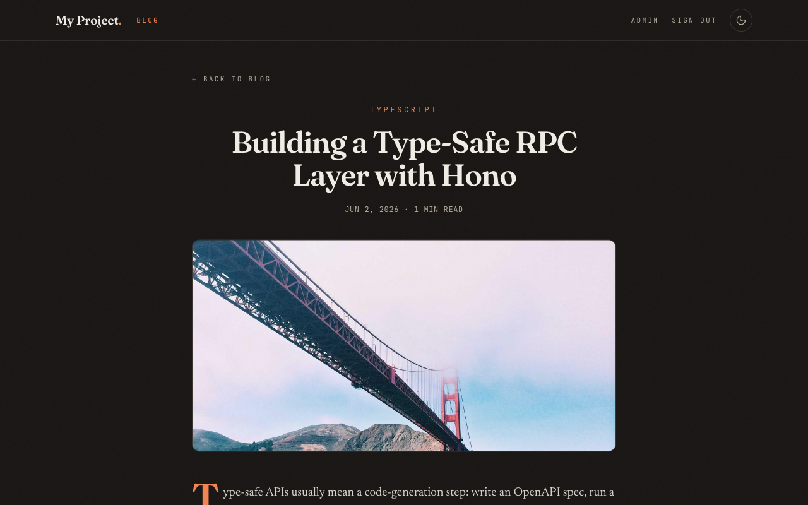
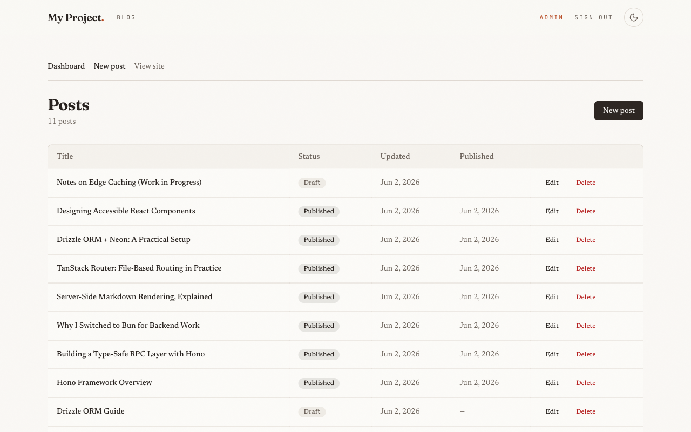
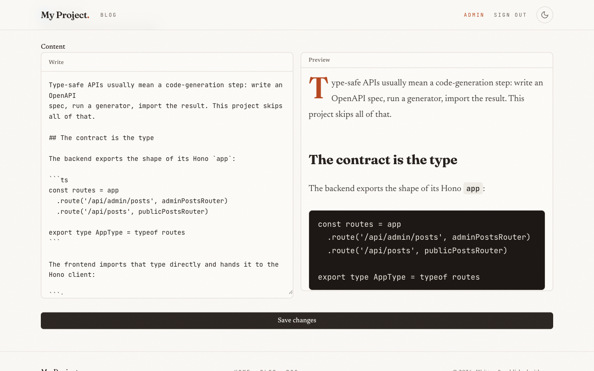
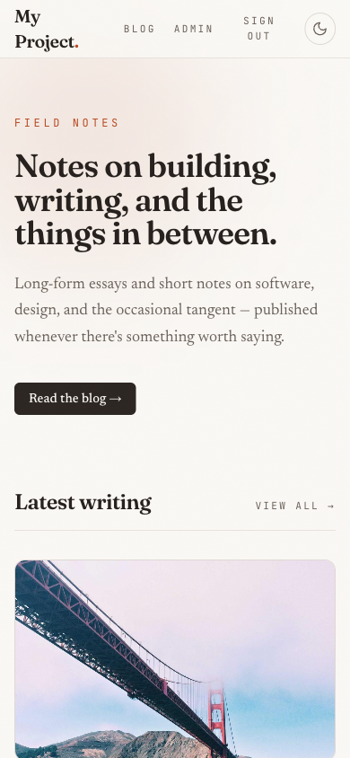

# Markdown Blog

A single-author developer blog. The author writes posts in Markdown from an authenticated admin area with a live split-pane preview; readers browse a fast, paginated public blog with tags, categories, reading-time estimates, and an RSS feed. Markdown is rendered and sanitized **server-side** so the editor preview is byte-for-byte identical to the published page.

Built as a **Bun-workspace monorepo** with an end-to-end **type-safe RPC contract** — the frontend imports the backend's `AppType` directly, so every API call is checked at compile time with zero codegen.

**Stack:** React 19 · Vite · TanStack Router + Query · Tailwind v4 · Hono · Bun · better-auth · Drizzle ORM · Neon Postgres · `unified`/`rehype-sanitize`

---

## Screenshots

|                     Home — hero & latest writing                     |                  Public blog list                   |
| :------------------------------------------------------------------: | :-------------------------------------------------: |
|  |  |

|                      Post — light theme                       |                         Post — dark theme                         |
| :-----------------------------------------------------------: | :---------------------------------------------------------------: |
|  |  |

|                        Admin dashboard                         |                     Markdown editor — split-pane live preview                      |
| :------------------------------------------------------------: | :--------------------------------------------------------------------------------: |
|  |  |

<p align="center">
  
  <br />
  <em>Responsive mobile layout</em>
</p>

---

## Features

- **Editorial reading experience** — warm "paper & ink" design with a persisted **light/dark theme toggle**, display/serif/mono typography (Fraunces · Newsreader · JetBrains Mono), a per-post reading-progress bar, and reveal animations gated by `prefers-reduced-motion`.
- **Home** — landing page with a hero and a "Latest writing" section (featured post + recent grid).
- **Auth-protected admin** — single author, email + password (better-auth). `/admin/*` redirects to `/login` when unauthenticated.
- **Markdown editor** — split pane (textarea + rendered preview), debounced server preview, keyboard-accessible toolbar.
- **Posts** — title, auto-generated (editable) slug, excerpt, Markdown content, cover image, category, tags, `draft`/`published` status, reading time.
- **Public blog** — paginated list (10/page), individual post pages with prev/next navigation, tag filtering.
- **RSS 2.0 feed** at `/feed`.
- **Reading time** computed on save and stored on the row.
- Consistent loading skeletons, empty states, and error states across public and admin pages.

---

## Architecture

```
markdown-blog/
├── backend/                 # Hono API on Bun
│   └── src/
│       ├── index.ts         # app composition + exported AppType (the RPC contract)
│       ├── routes/
│       │   ├── admin/       # auth-gated: posts CRUD + preview, categories
│       │   └── public/      # posts list/detail, RSS feed
│       ├── db/              # Drizzle schema + Neon client
│       ├── lib/             # auth, middleware, markdown pipeline, errors, logger, env
│       └── validation/      # shared Zod schemas
├── frontend/                # React 19 SPA on Vite
│   └── src/
│       ├── routes/          # file-based routes (blog/, admin/) — TanStack Router
│       ├── components/      # PostCard, PostBody, Pagination, admin editor, …
│       ├── hooks/           # TanStack Query data hooks
│       └── lib/             # RPC client, auth client, schemas, utils
└── package.json             # Bun workspace root
```

A few decisions shape the codebase:

- **Type-safe RPC contract (the key integration point).** `backend/src/index.ts` chains all routes and exports `AppType = typeof routes`. The frontend's `lib/client.ts` does `hc<AppType>(...)`, so request params and response shapes are inferred directly from the backend across the workspace boundary — no OpenAPI, no generated client. The shape of the Hono `app` _is_ the API contract.
- **Server-side Markdown.** Content is stored as raw Markdown and converted to sanitized HTML on the server via a `unified` pipeline (`remark-parse → remark-rehype → rehype-sanitize → rehype-stringify`) in `lib/markdown.ts`. The admin preview endpoint runs the **same** pipeline, so preview and published output never drift, and sanitization lives in exactly one place.
- **Auth.** better-auth (email + password) with the Drizzle adapter. A `requireAuth` middleware validates the session and gates every `/api/admin/*` route; public routes have no middleware.
- **Database.** Neon Postgres through Drizzle ORM using the **HTTP** driver (`drizzle-orm/neon-http`) — serverless-friendly, no connection pool to manage. Schema changes flow through `drizzle-kit`.
- **Frontend data.** TanStack Router (file-based) carries a single TanStack Query `QueryClient` in its context, so loaders and components share one cache. Tailwind v4 (CSS-variable tokens) with `@tailwindcss/typography` `prose` styles for rendered post bodies.

---

## Getting Started

### Prerequisites

- [Bun](https://bun.sh) ≥ 1.1
- A [Neon](https://neon.tech) Postgres database (free tier is fine)

### Setup

```bash
# 1. Install all workspace dependencies
bun install

# 2. Configure environment (see Environment Variables below)
cp backend/.env.example backend/.env
cp frontend/.env.example frontend/.env
#   …then edit backend/.env with your Neon DATABASE_URL and an auth secret

# 3. Create the database schema
cd backend && bun run db:push && cd ..

# 4. Start backend (:3000) + frontend (:5173)
bun run dev
```

Then open <http://localhost:5173>. Create your admin account once via better-auth's sign-up endpoint, e.g.:

```bash
curl -X POST http://localhost:3000/api/auth/sign-up/email \
  -H 'Content-Type: application/json' \
  -d '{"email":"you@example.com","password":"your-password","name":"You"}'
```

> If `bun run dev` doesn't bring up both servers in your shell, run them in separate terminals: `bun run dev:backend` and `bun run dev:frontend`.

---

## Environment Variables

**`backend/.env`**

| Variable             | Required | Description                                                                                      |
| -------------------- | :------: | ------------------------------------------------------------------------------------------------ |
| `DATABASE_URL`       |    ✅    | Neon Postgres connection string (`postgresql://…?sslmode=require`).                              |
| `BETTER_AUTH_SECRET` |    ✅    | Secret used to sign sessions. Generate with `openssl rand -base64 32`.                           |
| `BETTER_AUTH_URL`    |    ✅    | Public base URL of the backend (e.g. `http://localhost:3000`).                                   |
| `FRONTEND_URL`       |    ✅    | Frontend origin — used for CORS (with credentials) and RSS links (e.g. `http://localhost:5173`). |
| `PORT`               |    ✅    | Port the backend listens on (e.g. `3000`).                                                       |

**`frontend/.env`**

| Variable       | Required | Description                                                         |
| -------------- | :------: | ------------------------------------------------------------------- |
| `VITE_API_URL` |    —     | Backend API base URL. Defaults to `http://localhost:3000` if unset. |

---

## Scripts

Run from the repo root:

| Script                                         | Description                                                         |
| ---------------------------------------------- | ------------------------------------------------------------------- |
| `bun run dev`                                  | Backend + frontend together (hot reload).                           |
| `bun run dev:backend` / `bun run dev:frontend` | Run a single side.                                                  |
| `bun run build`                                | Typecheck both packages, then build the frontend production bundle. |
| `bun run typecheck`                            | `tsc --noEmit` across backend + frontend.                           |
| `bun run test`                                 | Run the full Vitest suite (backend + frontend).                     |
| `bun run lint` / `bun run lint:fix`            | ESLint over the workspace.                                          |
| `bun run format` / `bun run format:check`      | Prettier.                                                           |

Database (run from `backend/`):

| Script                | Description                                |
| --------------------- | ------------------------------------------ |
| `bun run db:generate` | Generate a SQL migration from `schema.ts`. |
| `bun run db:migrate`  | Apply migrations.                          |
| `bun run db:push`     | Push the schema directly (dev shortcut).   |
| `bun run db:studio`   | Open Drizzle Studio.                       |

---

## API Overview

The Hono `app` shape is the source of truth; this table mirrors it.

| Method     | Path                       | Auth | Description                                                |
| ---------- | -------------------------- | :--: | ---------------------------------------------------------- |
| `POST/GET` | `/api/auth/**`             |  —   | better-auth handlers (sign-up, sign-in, session, …).       |
| `GET`      | `/api/health`              |  —   | Health check.                                              |
| `GET`      | `/api/me`                  |  ✅  | Current authenticated user (example protected route).      |
| `GET`      | `/api/admin/posts`         |  ✅  | List all posts (any status), newest-updated first.         |
| `POST`     | `/api/admin/posts`         |  ✅  | Create a post.                                             |
| `GET`      | `/api/admin/posts/:id`     |  ✅  | Fetch a post for editing.                                  |
| `PUT`      | `/api/admin/posts/:id`     |  ✅  | Update a post.                                             |
| `DELETE`   | `/api/admin/posts/:id`     |  ✅  | Delete a post (hard delete).                               |
| `POST`     | `/api/admin/posts/preview` |  ✅  | Render Markdown → sanitized HTML (editor preview).         |
| `GET`      | `/api/admin/categories`    |  ✅  | List categories.                                           |
| `GET`      | `/api/posts`               |  —   | Published posts, paginated. Query: `page`, optional `tag`. |
| `GET`      | `/api/posts/:slug`         |  —   | Single published post incl. rendered HTML + prev/next.     |
| `GET`      | `/feed`                    |  —   | RSS 2.0 feed of the latest published posts.                |

Errors are returned as structured JSON: `{ "error": { "code": string, "message": string } }`.

---

## Testing

[Vitest](https://vitest.dev) on both sides:

- **Backend** runs against an in-memory Postgres ([PGlite](https://github.com/electric-sql/pglite)) — tests exercise **real SQL**, constraints, and the auth middleware rather than mocking the database. Covers posts CRUD, slug uniqueness, Markdown preview/sanitization, unauthorized access, and payload validation.
- **Frontend** uses Testing Library + happy-dom for component and guard tests (loading states, unauthorized redirect).

```bash
bun run test
```

---

## Design Decisions & Tradeoffs

- **Server-side Markdown rendering.** Centralizing the `unified` + `rehype-sanitize` pipeline on the backend guarantees the preview matches the published page and keeps sanitization in one auditable place. The cost is a (debounced) network round-trip for live preview — an acceptable trade for correctness and a single render path.
- **Shared-type RPC over codegen.** Importing `AppType` across the workspace gives instant, refactor-safe types with no build step or schema drift. It intentionally couples the frontend's typecheck to the backend's route shape — that coupling _is_ the contract.
- **Neon HTTP driver over a pooled TCP connection.** Fits serverless/edge deployment and removes connection-pool management; the tradeoff is no long-lived transactions, which this CRUD workload doesn't need.
- **Hard delete over soft delete.** Matches the single-author scope and keeps queries simple; there's no post history/audit trail.
- **Single-author, no RBAC.** One admin account, no roles or multi-user permissions — deliberately scoped down.
- **Reading time stored on save.** Computed once with `reading-time` and persisted, so list and detail responses stay cheap.
